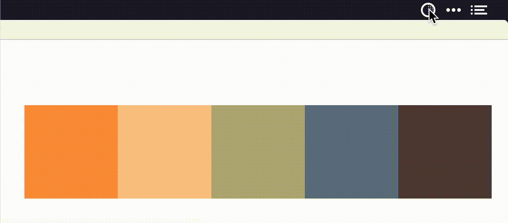

# Constrast.app

[Contrast](https://usecontrast.com/) is another simple app that lives in your menu bar. It allows you to test two different colours for accessibility against the WAI-Aria standards. Setting shortcuts allows you to click through and test a series of colours quickly.

If you have a colour that absolutely must pass, you can click into the colour input and use up/down arrows to change the lightness. Hold shift for even bigger lightness changes.

