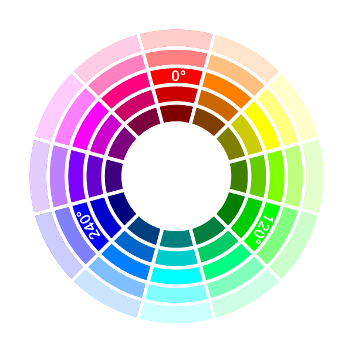
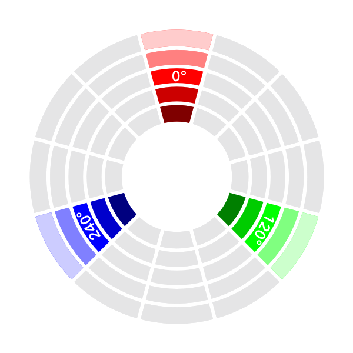
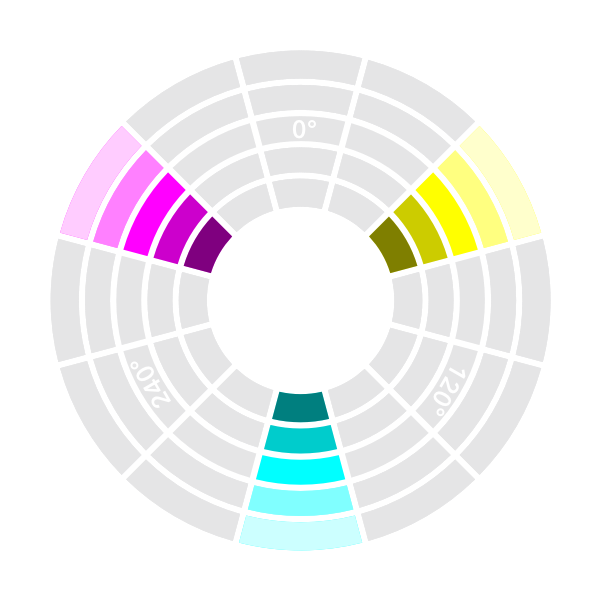
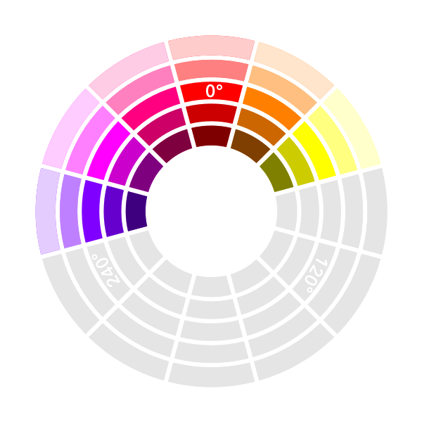
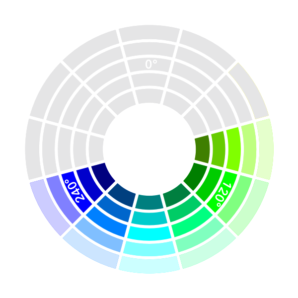

# HSL

With HSL (Hue, Saturation, Lightness), devs and designers have an easy way of coding colour values that is way easier to visualize; freeing dependence on apps

Hue is a value from 0 to 360 degrees (around a circle). 0 (and 360) is red. 120 is green. And 240 is blue. We still have an RGB model, but it’s easier to start visualizing colours as part of “rainbow” order.

Saturation is from 0 to 100%. This determines whether the colour is grey, dull shades, or vibrant colour.

Lightness is also from 0 to 100%. 0% is black. 100% is white. 50% will show pure colour.

So, if we go back to our yellow-green example, we can quickly guess `hsl(75, 60%, 60%)`. 75 degrees being closer to yellow (at 60 degrees) than green (120 degrees). We dull it down and add a touch of white with saturation and lightness to round it out.

  See the Pen <a href="https://codepen.io/davecross/pen/f4c3347c6cb3cd843790abbdac283c8f/">
  HSL sliders</a> by Dave Cross (<a href="https://codepen.io/davecross">@davecross</a>)
  on <a href="https://codepen.io">CodePen</a>.

Unlike a traditional colour wheel, the primary colours of this hue wheel are red, green, and blue. In an interesting twist, the secondary colours are cyan, magenta, and yellow (the primary colours of CMYK, used in print).

And there’s even more power in this colour wheel. All the “warm” colours are at the top (270-90) while all the “cool” colours are on the bottom of the wheel (90-270).

It’s easy to gain a comfortable mastery over HSL in under an hour. More importantly, it gives designers and developers a common, empirical method of describing colour in code. Any tools/methods that are cross-discipline are an immediate win in my books.

  See the Pen <a href="https://codepen.io/davecross/pen/4a2e49cf95b616c43b25c423ece3f584/">
  hsl colorwheel</a> by Dave Cross (<a href="https://codepen.io/davecross">@davecross</a>)
  on <a href="https://codepen.io">CodePen</a>.

<codepen/>
