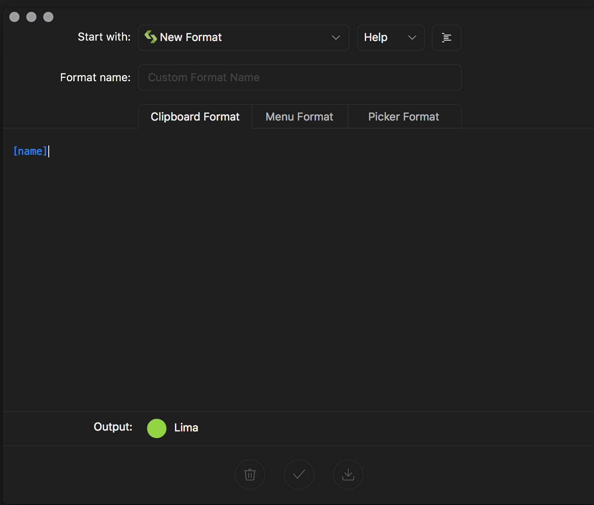

# Sip: Custom Formats

**Custom formats are the secret weapon for developers.** If you create custom formats, you can paste the exact colour code you need, comments and all.

Start by clicking the menu bar arrow and then the _burger_ icon. Select _Custom Format,_ which should show a window for making your new creation.



In the custom format modal, you can add functions and text in a JSON format. All the available customizations outside of text are in the help dropdown and can easily be copy/pasted into place.

The first place to start is on the Magnifier Format tab. Enter something basic that will give you a nice display when using the loupe. Then, switch to the Clipboard Format tab and create your masterpiece.

::: warning Note
In _Sip 1_ used to allow a plain string with valid placeholders. That's no longer the case for _Sip 2_ and all custom formats must be valid JSON. If you only want a simple string, use the `concat()` function and leave the second string empty.
:::

### Basic Magnifier format

```json
{
  "function": "concat",
  "x": "[name]: ",
  "y": "#hex[red]hex[green]hex[blue]"
}
```

### SCSS Variable declaration

```json
{
  "function": "concat",
  "x": {
    "y": " ",
    "function": "strreplace",
    "x": {
      "x": "$color-[name]",
      "function": "lower"
    },
    "z": "_"
  },
  "y": ": HSLA(css[hue], css[saturation]%, css[lightness]%, css[alpha]) // #hex[red]hex[green]hex[blue]\n"
}
```

### SCSS Variable Call

```json
{
  "z": "_",
  "x": {
    "x": "$color-[name]",
    "function": "lower"
  },
  "y": " ",
  "function": "strreplace"
}
```

Custom formats can also be shared. For the two advanced formats above, I've linked to a format file that can be imported into Sip.

For a good explanation on why you don’t need some special naming convention, read through: [davidwalsh.name/sass-color-variables-dont-suck][1]

[1]: https://davidwalsh.name/sass-color-variables-dont-suck
