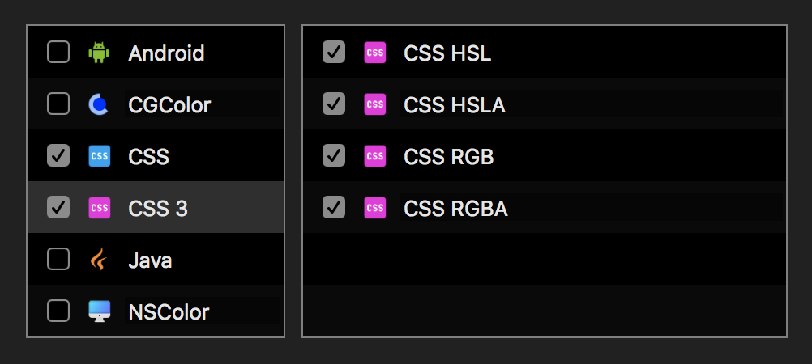
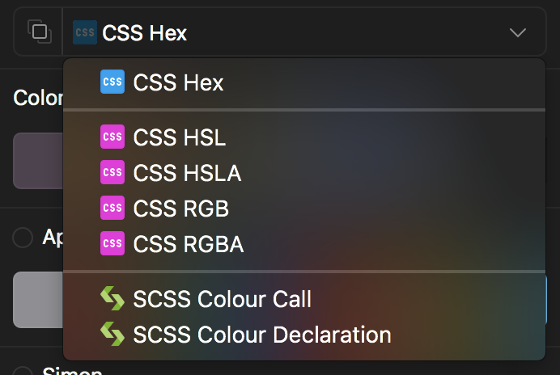
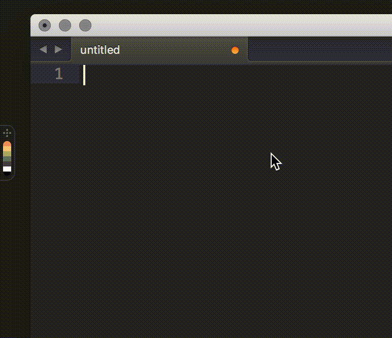

# Sip in code

Developers can use Sip with just a little set-up (and will probably benefit more over time).

To start, there are lots of different formats. You can reduce the types displayed by going to settings and unchecking formats you don’t want to see.

Back in the menu bar, select the format you want to use. Now, clicking on colour chips in the dock will copy that colour (in that format) to the clipboard.

In many text editors, you can also cmd+click on the colour and have it pasted into the code directly.

