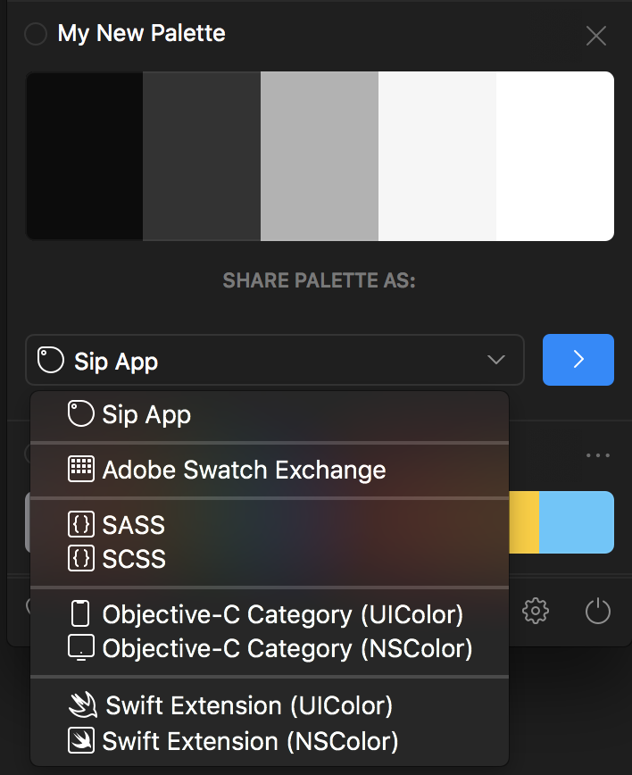

# Sip: Sharing Palettes

Sip offers a bunch of popular formats for sharing palettes.

Within the palette display, click the dropdown selector to see all options. Once an option is selected, hit the arrow icon and follow the next steps to save your palette.

Some popular options:

- Sip Palette: Allows importing into Sip by other designers and devs.
- SCSS: Good for handing to a developer so they can immediately import into a project and get to work. Unfortunately, the names are all defaults (we’ll see better ways later where a Sip Palette file would be the better option).
- HTML: A nicely displayed page of colour chips. Great for sharing with clients in moodboards. (Not in Sip2 yet)
- Webpage: Exactly the same as HTML, but hosted on Sip’s servers. Also unprotected, so don’t put delicate information into the _readme_ section. (Not in Sip2 yet)
