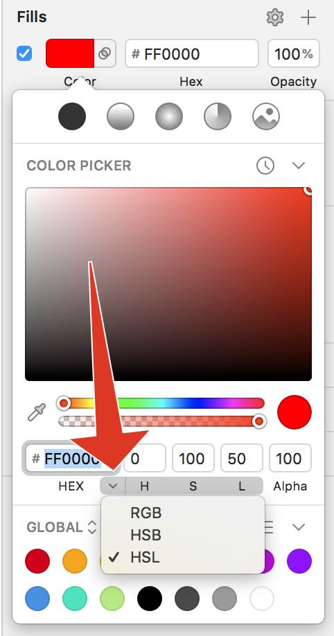

# HSL in Sketch

Sketch v53+ will display HSL colour values. With your colour palette open, hover over the "RGB" text and then click on the little arrow that appears. From here, you have one of 3 options. Pick HSL.

This won't change the colour picker itself -- that will still display an HSB view -- but the outputted values will be accurate.

