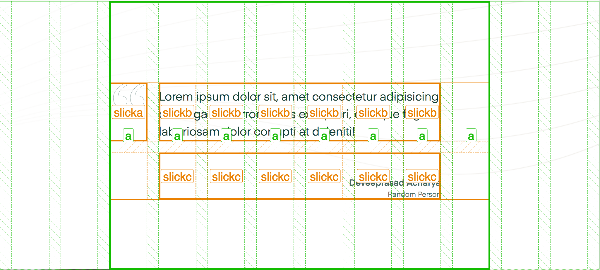

# Grids inside grids

Lining up grids inside of grids requires that the outside number of columns _used_ are the same as the column count for the internal grid. The other requirement is to avoid left and right margins/padding on the inner grid so that everything can line up as desired. There a a handful of reasons why you might do this: special one-off components, carousels where the slides need to align with the normal layout (adding a grid to children of children of children), and others.

```
          this
       +------+------+------+------+
       |      |      |      |      |
       |  z   |  z   |  z   |  z   |
       |      |      |      |      |
       +------+------+------+------+

          ... will go inside this
+------+------+------+------+------+------+
|      |      |      |      |      |      |
|  .   |  a   |  a   |  a   |  a   |  .   |
|      |      |      |      |      |      |
+------+------+------+------+------+------+
```

I've used this most when the child element's mark-up is buried inside the child element. Carousels are most common here since they add a lot of internal mark-up to make themselves work, but we still want things to align to the grid.


If we use Firefox's devtools, it's easy to see how the inner grid has been made to match the outer grid.


