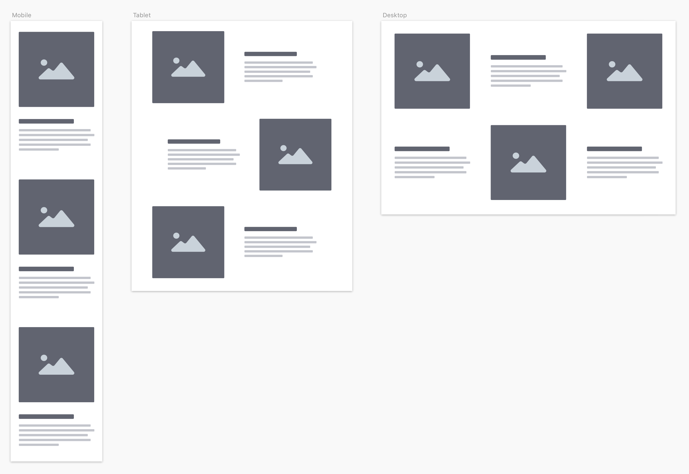

# A digression into mobile first

By going mobile-first, you control source order in a way that benefits accessibility and SEO.

The real benefit for us is in how we plan a project. If you’ve ever moved to a smaller house, you know the experience of having too much stuff.

When you start with “desktop first”, you suffer the same fate. Where do you put it al as the screen width shrinks? People end up making impractical choices and compromising on the design.

Instead, we should start “mobile first”. Put the content on the page in an order that makes sense **without any styling**. This is your _source order_ and it works for people that use screen readers and SEO bots.

After you have that locked in, add some styles. Then, expand the screen until things look ugly. That is when you add a breakpoint and move things around. Letting the design inform unique breakpoints is also a regression from traditional web-design planning.

Keep expanding and rearranging content until you hit your max-width or the largest screen you can plan for.

  See the Pen <a href="https://codepen.io/davecross/pen/7dd4a7d93b6e1501e272a5ff631ce664/">
  Mobile to Desktop (mobile first)</a> by Dave Cross (<a href="https://codepen.io/davecross">@davecross</a>)
  on <a href="https://codepen.io">CodePen</a>.

<codepen/>
