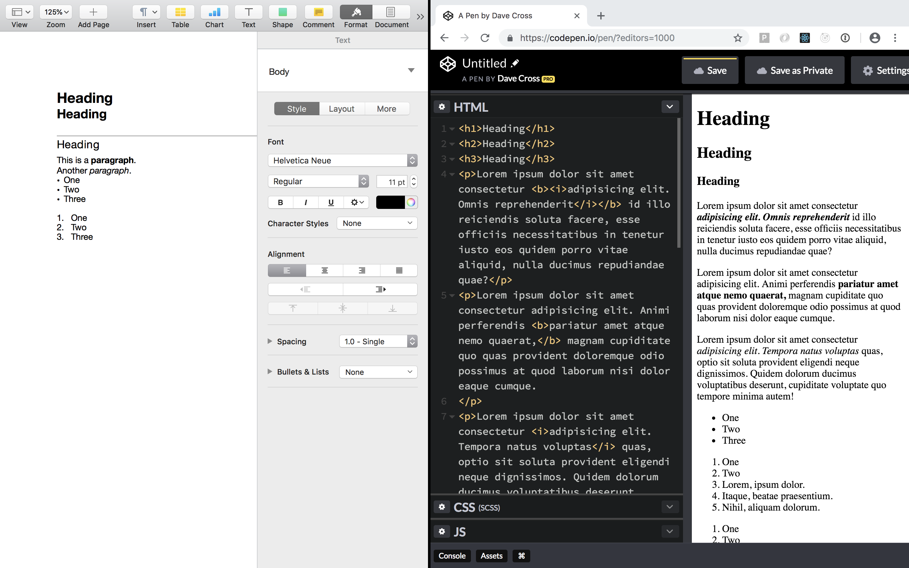
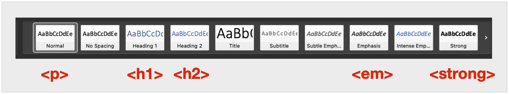
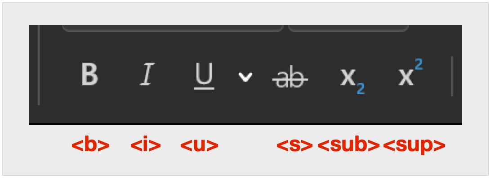
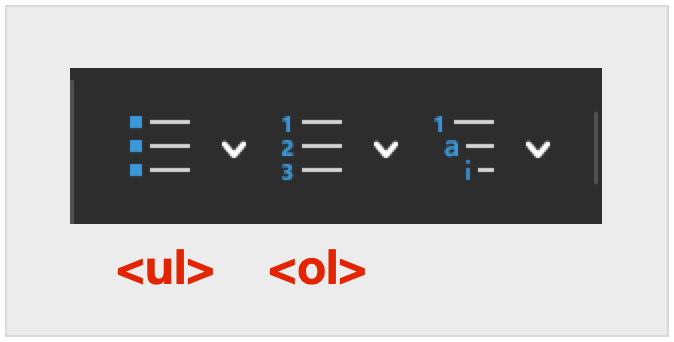

# HTML Quickstart



Jumping into basic HTML is easiest if we scaffold onto knowledge you already have. Microsoft Word, Apple Pages, and Google Docs all offer "WYSIWYG" ("What You See Is What You Get") editors that parallel the tags we use in HTML.

The location of each item might change, but thanks to standard UI practices, most make use of the same icons. And thanks to HTML being the standard language of the web, we have an almost one-to-one matching of word processor elements to HTML tags.

If you want to try this, putting a word processor window next to a browser window with Codepen will allow you to see the similarities as we move along.


## Paragraph tags



We can control the style of whole "paragraphs" using the style palette in word processors. Each "paragraph" gets styled in ways that make it look like a heading, body text or something else. 

The default is a "normal" style, which lines up with the `<p>` tag.

```html
<p>I look like "normal" body text.</p>
```

"Heading 1" and "Heading 2" line up with `<h1>` and `<h2>` respectively. We get access to 6 heading levels, so you could go all the way to `<h6>`, but most word processors won't have these as a default (and it's rare for designers to go that deep too).

```html
<h1>I'm some "Heading 1" text</h1>
<h2>I'm some "Heading 2" text</h2>
<h3>I'm some "Heading 3" text</h3>
<h4>I'm some "Heading 4" text</h4>
<h5>I'm some "Heading 5" text</h5>
<h6>I'm some "Heading 6" text</h6>
```


## Inline tags



We can also style things inside of the paragraphs and headings. We might want to bold, italicize, strikethrough, or change just a small section of text. These all correspond to HTML tags.

```html
<p>I'm a paragraph with some <b>bold</b> text.</p>
<p>I'm a paragraph with some <strong>strong</strong> text.</p>
<p>I'm a paragraph with some <i>italicized</i> text.</p>
<p>I'm a paragraph with some <em>emphasized</em> text.</p>
<p>I'm a paragraph with some <u>underlined</u> text.</p>
<p>I'm a paragraph with some <s>struckthrough</s> text.</p>
<p>I'm a paragraph with some <sub>subset</sub> text.</p>
<p>I'm a paragraph with some <sup>superset</sup> text.</p>
```

::: warning Note
You might have noticed that I added `<strong>` and `<em>` to this list instead of the "Paragraph Styles" section. Both of these tags are actually inline. Visually, they look the same as `<b>` and `<i>`, but have a more semantic meaning for screen readers and assistive technologies, and will be pronounced differently.

Whenever possible, we should use `<strong>` and `<em>`.
:::


## List tags



Inside of word processors, we have the option to add unordered and ordered lists. In either case, a bullet or number will be placed in front of any text for that list item.

In HTML, we also have unordered (`<ul>`) and ordered (`<ol>`) lists, but we use a second, "child" tag to seperate list items (`<li>`).

```html
<ul>
  <li>Item one</li>
  <li>Item two</li>
  <li>Item three</li>
  <li>Item four</li>
</ul>

<ol>
  <li>Item one</li>
  <li>Item two</li>
  <li>Item three</li>
  <li>Item four</li>
</ol>
```

We also have the option of putting any list inside of any other list.


```html
<ul>
  <li>Item one</li>
  <li>
    <ol>
      <li>Item one</li>
      <li>Item two</li>
      <li>Item three</li>
      <li>Item four</li>
    </ol>
  </li>
  <li>Item three</li>
  <li>Item four</li>
</ul>
```

## So why not use Microsoft Word to create websites?

That's a good question. The short answer is that almost no "HTML app" has gotten the code right. They all result in extra code that will be hard to debug and harder to style.

By learning to code and mark up your html, you ensure that your website is displayed exactly as you intended. No extra cruft, and no extra fluff.
