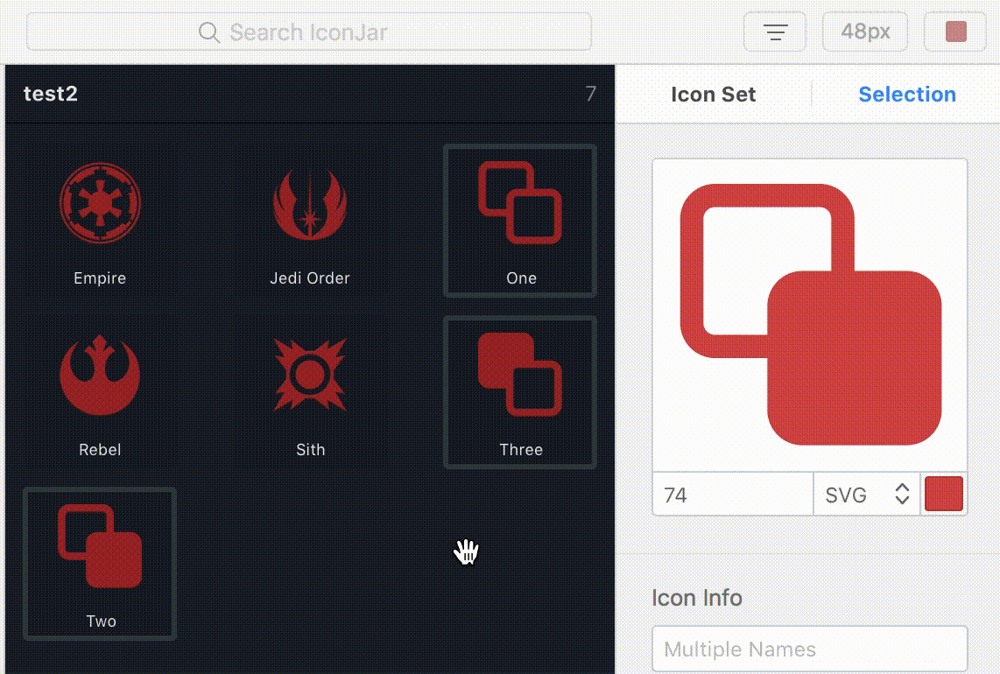
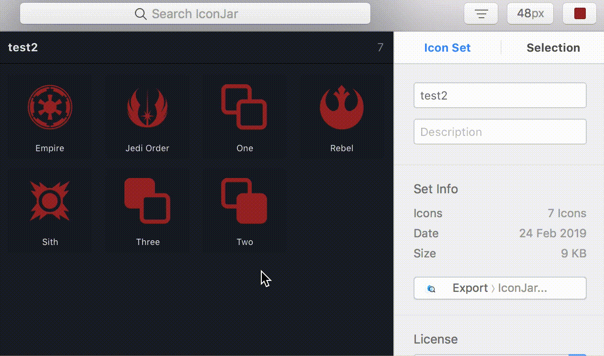

# IconJar for Developers

For developers, IconJar offers a few extra options for using icons in code.

The simplest method is to drag icons into your project folder. This will generate a single file for each selected icon. Dragging will maintain any preview settings you've used.

Another method is to right-click and select “copy as base64” or “copy as inline svg”. Both these allow you to paste the file into code. Using this method, you get the original code without any preview settings.

