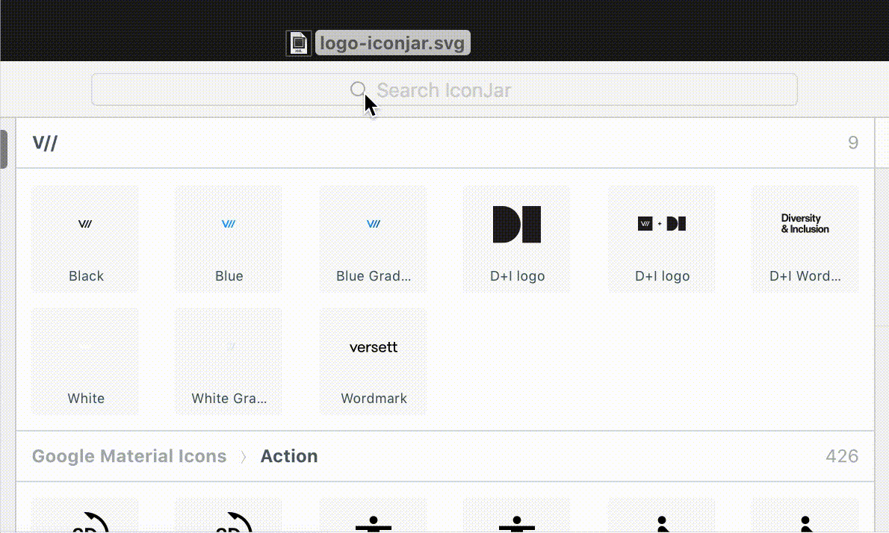
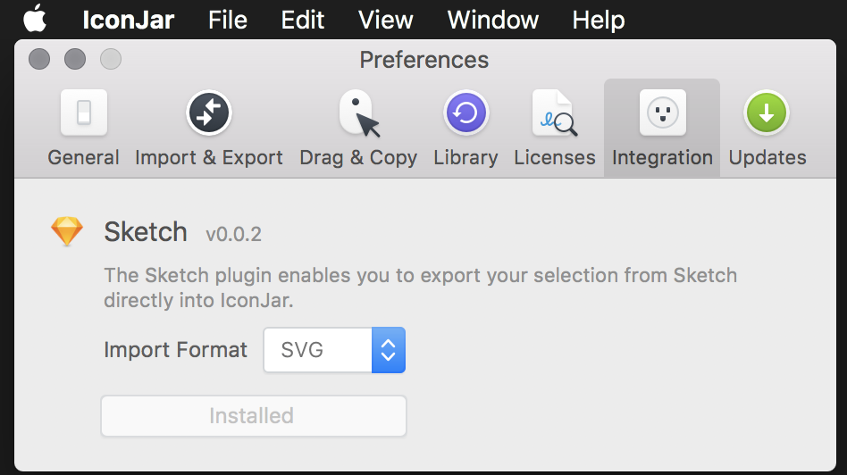

# IconJar: Importing Files

Importing batches of icons into IconJar is very fast.

Drag and drop entire folders onto the app and it will ask where you’d like them placed. Select a name for a new group or select a current group and the icons are added to it.

Sketch also has a plugin for adding icons. Activate it from inside IconJar's preferences.

Inside sketch, select the icons you want to import and select _Plugins -> Export to IconJar…_. It will switch to iconjar and show the import dialog.

