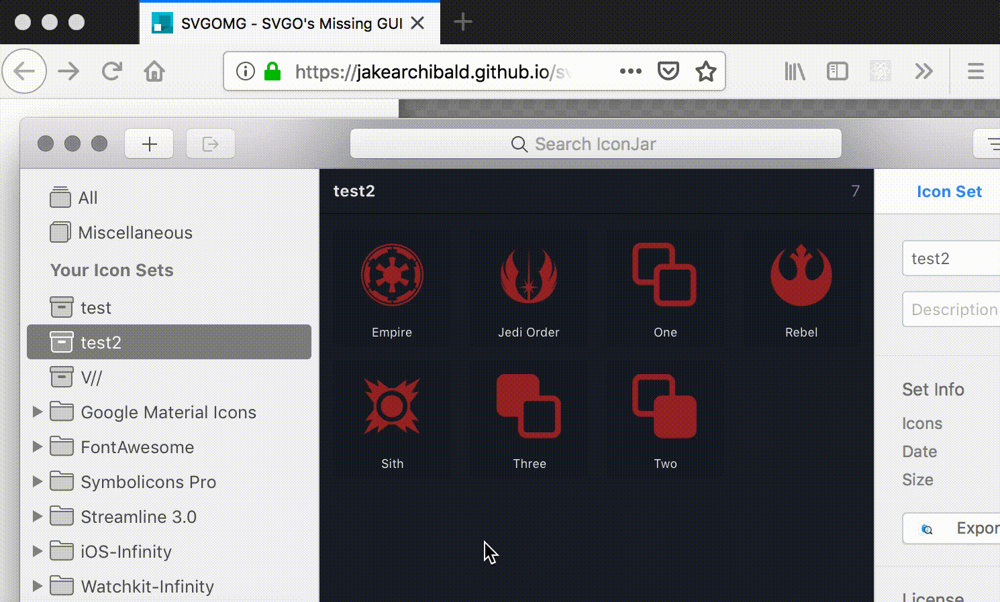

# svgOMG

All final images should be optimized and reduced in file size. PNG, JPEG, GIF, and video all have multiple choices when it comes to optimizing.

SVG has a couple options too, but [svgOMG](https://jakearchibald.github.io/svgomg/) is best in class when it comes to optimizing SVGs. There are a ton of options for what to remove, but I've found the defaults to be very good. You can just drag and drop and image onto the webpage, and save an optimized version back to your computer.

Some SVGs don't optimize as well as you might hope. Mostly, this is because of how they are nested and grouped. There are a few things you can do to help the process if you’re optimizing SVGs straight out of apps like Sketch.

- ungroup as much as possible. Make the icon layers very flat
- use the layer merging functions and then “flatten” the icon. This will help svgOMG optimize the paths used.
- unless you are doing something specific with stroked paths, all paths should be converted to outlines.
- convert all text to outlines unless you can guarantee your font will be available.
- use simple shapes. It takes less code to describe a `<circle>` than a `<path>` in the shape of a circle.

**My workflow for svgOMG** is to copy the paths out of IconJar or Sketch directly and paste them in as mark-up. This saves a step and doesn't require temporary, intermediate files. After the file is processed, I copy it into a new file or inline inside mark-up.

You can also drag and drop to svgOMG, but I've found this stops working sometimes, so knowing how to copy code like above is a good idea.

